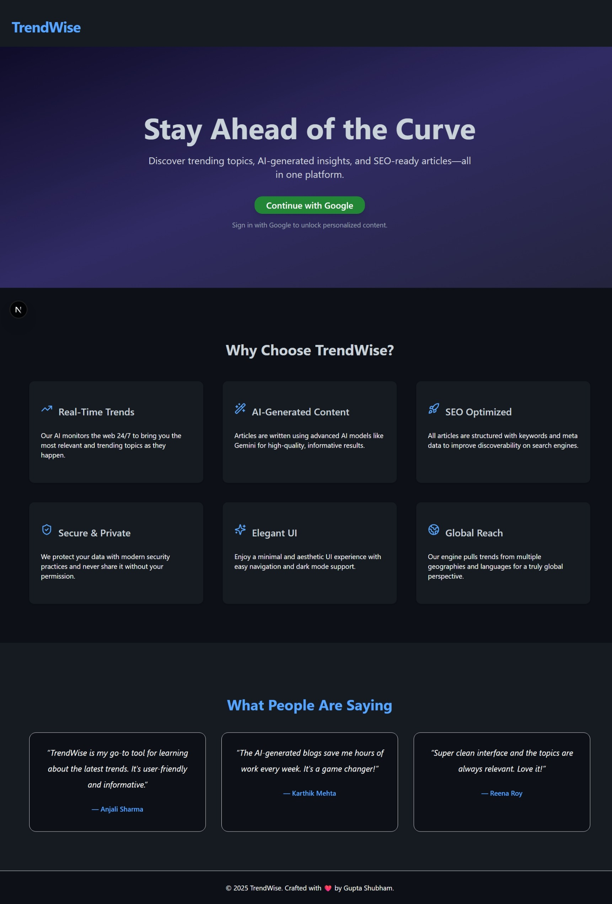
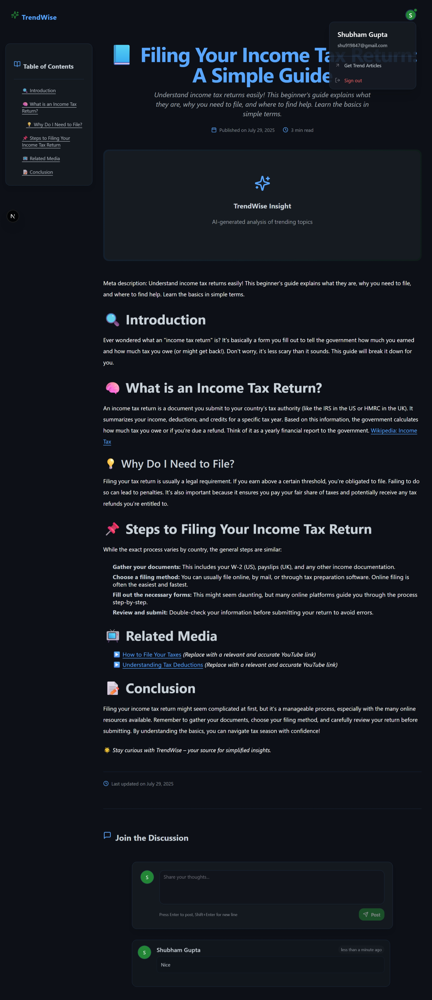
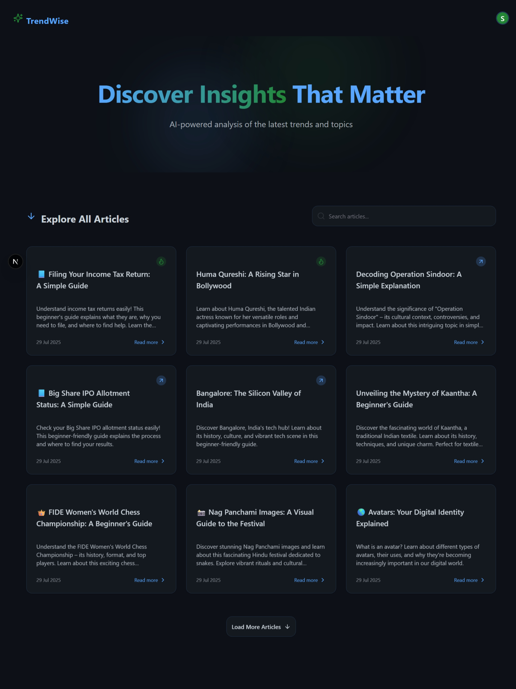

# 🧠 TrendWise

**TrendWise** is a full-stack AI-powered content platform that curates trending topics from the web and generates high-quality, SEO-optimized blog articles using **Gemini AI**. Built with modern technologies including **Next.js**, **Express**, **MongoDB**, and **pnpm** as the package manager.

> **Note**: This project is a work-in-progress.

## Screenshots

### Home Page


### Article Page


### Articles


---

## 🗂️ Project Structure

```
guptashubham-11-trendwise/
├── client/      # Next.js frontend
└── server/      # Express + TypeScript backend
```

---

## 🚀 Features

- 🔍 Real-time web scraping of trending topics
- 🧠 AI-generated articles using Gemini
- 📝 SEO-optimized content
- 🔐 Google authentication (NextAuth)
- 💬 Article commenting system
- 🧾 Cron jobs for automated trend updates
- 🎨 Modern responsive UI (Tailwind + shadcn/ui)
- ⚙️ pnpm workspaces support

---

## 📦 Monorepo Setup with pnpm

> Make sure you have `pnpm` installed globally:

```bash
npm install -g pnpm
```

Initialize & install everything:

```bash
pnpm install --recursive
```

---

## 🧑‍💻 Frontend - [`client/`](./client)

### 🛠 Tech Stack

- **Next.js (App Router)**
- **TypeScript**
- **Tailwind CSS** + custom theme
- **shadcn/ui**
- **NextAuth.js** for authentication
- **Axios** for API communication

### 📁 Key Files

- `app/`: App Router pages (`page.tsx`, `layout.tsx`)
- `components/`: UI & reusable logic (auth button, header, cards, etc.)
- `lib/`: Utility helpers like Axios client and session sync
- `middleware.ts`: Auth middleware for route protection
- `app/api/auth/[...nextauth]/`: Google OAuth implementation

### ▶️ Run Frontend

```bash
cd client
pnpm dev
```

It starts on `http://localhost:3000`

### 🔑 Setup `.env.local`

```bash
NEXTAUTH_SECRET=your_secret

GOOGLE_CLIENT_ID=your_google_id
GOOGLE_CLIENT_SECRET=your_google_secret

NEXT_PUBLIC_API_BASE_URL=http://localhost:8000
```

---

## 🧠 Backend - [`server/`](./server)

### 🛠 Tech Stack

- **Express.js**
- **TypeScript**
- **MongoDB** via **Mongoose**
- **Node-cron** for automated article generation

### 📁 Key Folders

- `controllers/`: Route logic for articles, users, comments
- `routes/`: All HTTP routes including articles, comments, sitemap, etc.
- `models/`: Mongoose schemas for `User`, `Article`, and `Comment`
- `utils/`: Custom error handling, scraping, AI prompt logic
- `cron/jobs.ts`: Auto article generation using scraped trends

### ▶️ Run Backend

```bash
cd server
pnpm dev
```

It starts on `http://localhost:8000`

### ⚙️ Setup `.env.local`

Create a `.env.local` file from `.env.sample`:

```env
PORT=8000
MONGODB_URI=your_mongo_uri
CLIENT_URL=http://localhost:3000
DB_NAME = your_db_name

GEMINI_API_KEY=your_google_gemini_key
```

---

## 🔁 Connecting Frontend & Backend

- Frontend uses `NEXT_PUBLIC_BACKEND_URL` to call API routes.
- Google sign-in from frontend is forwarded to the backend for user persistence (`sendUserToBackend.ts`).

---

## ⏰ Scheduled Jobs

- Backend has cron jobs to automatically fetch trends and generate articles every few hours.
- Defined in `server/cron/jobs.ts`.

---

## 🧪 Testing

- **Frontend**: Manual testing via UI
- **Backend**: Use Postman/ThunderClient for routes
- Add tests in the future via `vitest` or `jest` for both

---

## 🔐 Authentication

- **Google OAuth** via `NextAuth.js` in frontend
- After sign-in, session is sent to backend to create a user if not present

---

## 🧱 Deployment Tips

- **Frontend**: Deploy on Vercel
- **Backend**: Deploy on Render / Railway / Fly.io
- Make sure CORS is properly configured in Express backend
- Set environment variables on both platforms

---

## 🧰 Scripts

| Location | Command           | Description                  |
|----------|-------------------|------------------------------|
| client   | `pnpm dev`        | Start frontend               |
| client   | `pnpm build`      | Build frontend               |
| server   | `pnpm dev`        | Start backend in dev mode    |
| server   | `pnpm build`      | Build backend for production |
| root     | `pnpm install -r` | Install dependencies in both |

---

## 📚 Future Improvements

- 🔎 Advanced AI filtering for trend relevance
- 🌍 Multi-language support
- 📈 Analytics dashboard
- 🧾 AI article editing interface

---

## 👨‍💻 Author

**Gupta Shubham**  
[Portfolio](https://gupta-shubham-11.vercel.app) • [LinkedIn](https://www.linkedin.com/in/guptashubham11)